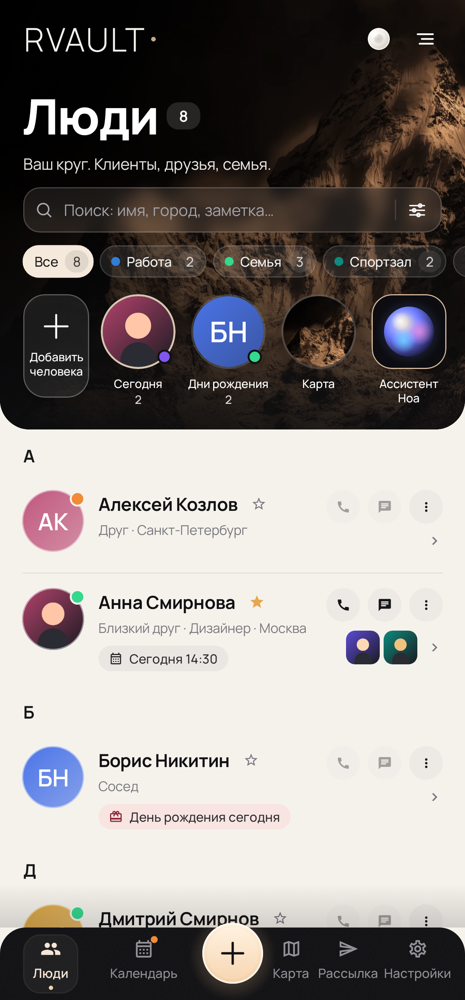
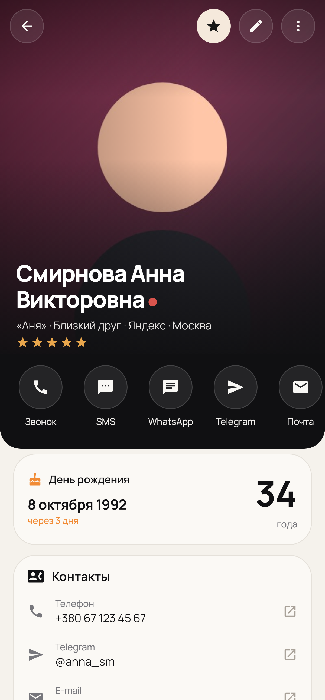
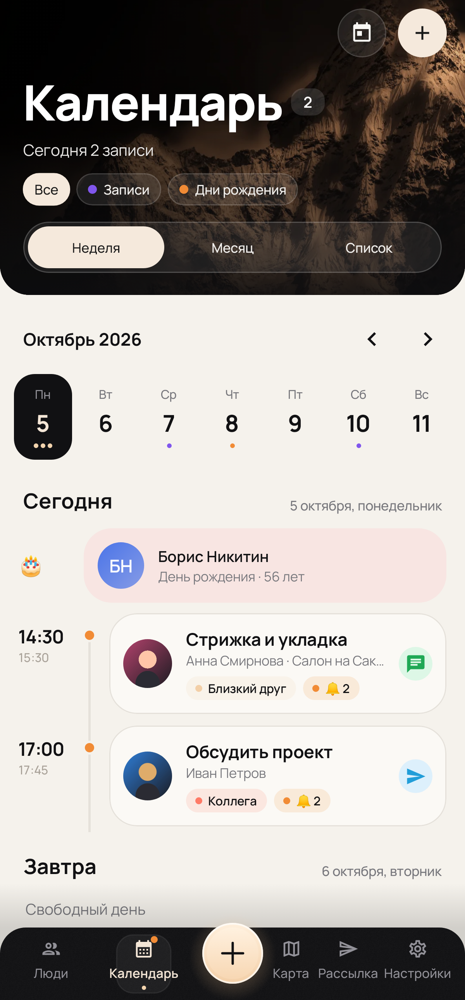
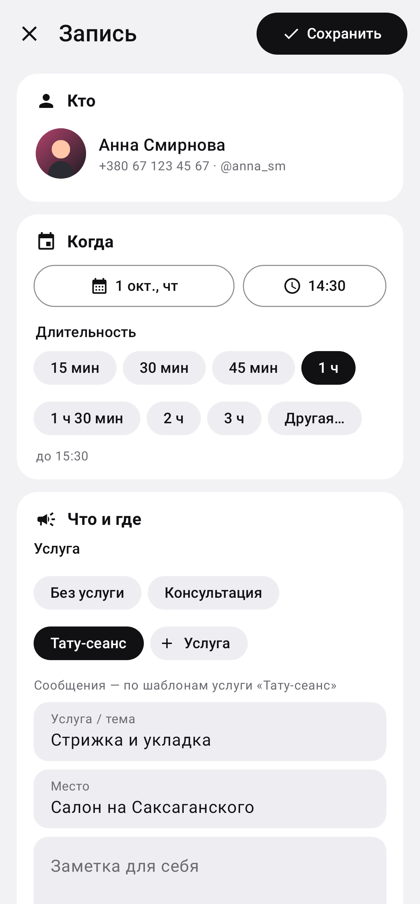
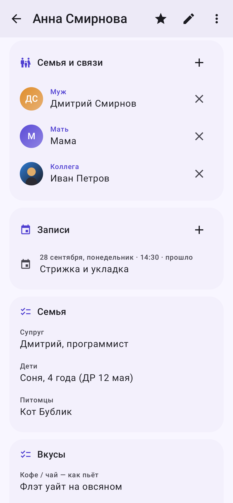
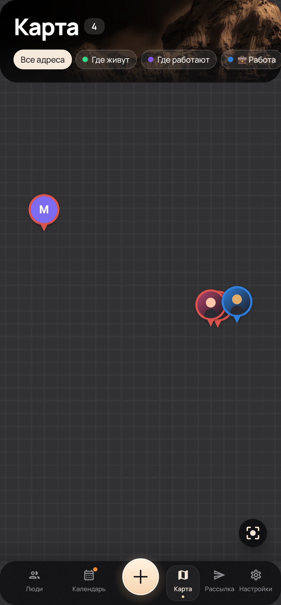
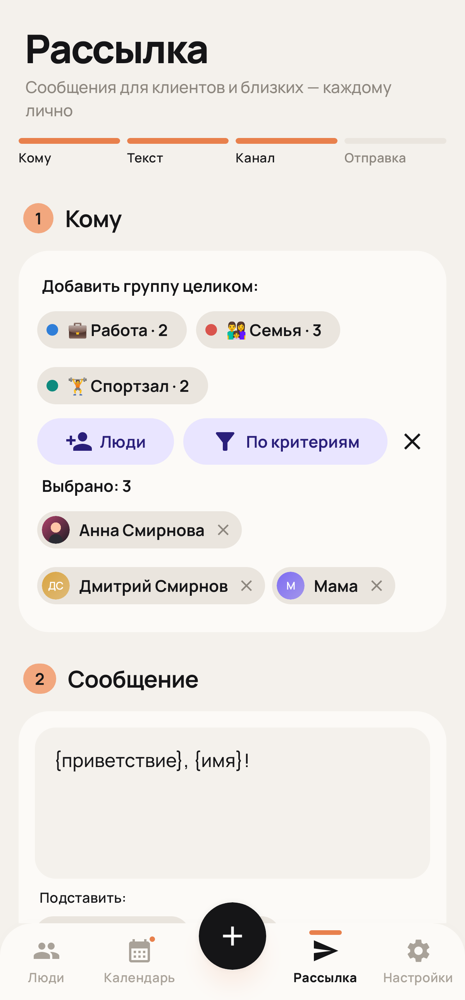
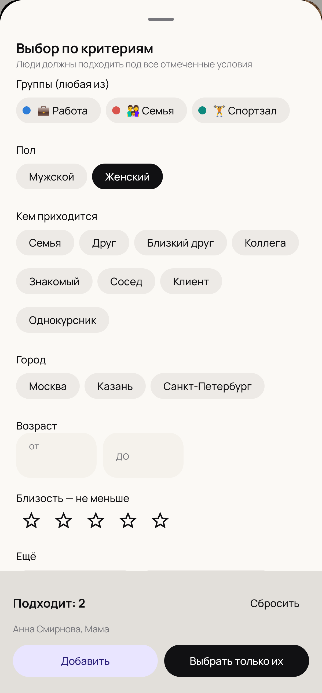

# RVault

Личный зашифрованный архив людей для Android: фото, контакты и любые мелочи о каждом человеке, поиск по всем полям и рассылки через SMS и мессенджеры.

| Главная | Карточка | Календарь | Запись |
|---|---|---|---|
|  |  |  |  |

| Связи | Карта | Рассылка | Критерии |
|---|---|---|---|
|  |  |  |  |

## Возможности

- **Карточка человека**: ФИО, прозвище, пол, день рождения, кем приходится, близость (звёзды), работа, город, адрес, как познакомились, заметки.
- **Детали до мелочей**: произвольные поля по разделам, плюс готовые подсказки: семья, интересы, вкусы, подарки и размеры, здоровье, характер, связи, важные даты.
- **Фото**: галерея у каждого человека (из галереи телефона или с камеры), просмотр с зумом, подписи, выбор главного фото.
- **Хроника**: встречи, звонки, подарки, события с датами. Показывает, когда вы последний раз общались.
- **Поиск по всему**: имя, телефон, хобби, заметки, хроника, группы. Показывает, где нашлось совпадение.
- **Группы** с цветами и значками; фильтры, избранное, сортировки (в том числе «давно не общались»).
- **Рассылка**: WhatsApp и Telegram по очереди с персональным текстом (`{имя}`, `{имя_отчество}`…), SMS автоматически каждому, SMS одним сообщением на все номера, отправка в групповой чат любого мессенджера. При желании каждая отправка пишется в хронику.
- **Календарь записей**: месяц с листанием и список ближайших. Запись человека на дату и время с длительностью, услугой и местом, предупреждение о пересечениях. Сразу после записи можно отправить подтверждение (WhatsApp / Telegram / SMS), текст можно поправить. Напоминания человеку и себе с любыми интервалами («за сутки», «за 2 часа», своё). Перенос, отмена и «состоялось» с уведомлением человека. Шаблоны всех сообщений настраиваются.
- **Услуги**: «Тату-сеанс», «Консультация» и т.д. — свои длительность, место, напоминания и тексты подтверждения, напоминания, переноса и отмены. Запись по услуге пишет человеку её текстами; пустой текст — общий шаблон.
- **Авто-отправка**: служба специальных возможностей сама нажимает «Отправить» в WhatsApp и Telegram, поэтому рассылки и напоминания уходят без ручного подтверждения. Паузу между сообщениями можно настроить.
- **Выбор получателей по критериям**: группы, пол, кем приходится, город, возраст, близость, скорый ДР, «давно не общались».
- **Карта**: адреса «Дом», «Работа» и другие на карте OpenStreetMap, с фото людей на метках, фильтрами и маршрутом.
- **Семья и связи**: муж/жена, родители, дети, братья и сёстры и т.д. Обратная связь и подписи по полу считаются сами.
- **Телефоны в международном формате**: выбираете страну, вводите «093 074 38 29», в базу сохраняется «+380930743829».
- **Язык сообщений**: русский, украинский или английский — шаблоны, даты, дни недели и приветствие рассылки. Для отдельного человека язык можно выбрать в карточке. Плейсхолдеры понимаются на любом языке: {имя}, {імʼя}, {name}.
- **Приветствие по времени суток**: `{приветствие}` (`{привітання}`, `{greeting}`) подставляет «Доброе утро», «Добрый день», «Добрый вечер» или «Доброй ночи» в момент отправки — в рассылках, подтверждениях и автоматических напоминаниях.
- **Язык приложения**: «Авто (как в системе)», русский, украинский или английский — весь интерфейс, даты и уведомления. Язык сообщений настраивается отдельно.
- **Голосовые заметки**: наговорите после встречи — звук шифруется прямо во время записи и расшифровывается в текст на самом телефоне (офлайн-распознавание Android 13+), без отправки в интернет. Текст можно поправить, запись — прослушать.
- **Перенос фото из галереи**: фото сохраняются в архив, а оригиналы удаляются с телефона навсегда, минуя корзину (на Android 11+ — после системного подтверждения).
- **Поиск по голосовым заметкам**: поиск находит людей и по расшифровкам того, что вы надиктовали.
- **Значок и название**: 8 вариантов на рабочем столе, в том числе маскировка («Заметки», «Калькулятор», «Погода», «Органайзер», «Файлы», «Контакты»), плюс своё название внутри приложения.
- **Дни рождения**: лента «скоро» на главной и уведомления в день рождения и за 3 дня.
- **Импорт** из контактов телефона (с фото и днями рождения).

## Приватность

- База данных зашифрована SQLCipher (AES-256), ключ лежит в Android Keystore.
- Фото хранятся во внутренней памяти приложения, зашифрованы AES-256 (ключ в Android Keystore) и не попадают в галерею.
- Свой PIN-код приложения (4–6 цифр, не PIN телефона; хранится только хэш PBKDF2) и вход по отпечатку. После 5 ошибок — пауза 30 секунд. Автоблокировка через минуту в фоне.
- Снимок при неверном PIN-коде: фронтальная камера тихо фотографирует того, кто подбирает PIN; журнал попыток со снимками (зашифрованы), после входа — предупреждение «Кто-то пытался войти».
- Безопасное копирование: скопированные из архива номера и адреса помечаются как секретные (клавиатура их не запоминает) и через 30 секунд стираются из буфера обмена.
- Встряхнуть — закрыть: резкое встряхивание мгновенно закрывает архив и убирает его из списка недавних приложений.
- Скриншоты запрещены, в списке недавних приложений содержимое скрыто.
- Автоматическая резервная копия: раз в день или неделю зашифрованный паролем файл кладётся в выбранную папку (память, SD-карта, флешка), хранятся последние 3/5/10 копий.
- Облачный бэкап Google отключён. Резервная копия — файл `.krtk`, зашифрованный вашим паролем (PBKDF2 + AES-256).

## Установка

APK собирается GitHub Actions при каждом push: **Actions → Build APK → Artifacts → RVault-apk**. Скачайте файл на телефон и установите приложение RVault (Android 8.0+).

Сборка локально: `./gradlew :app:assembleRelease` → `app/build/outputs/apk/release/app-release.apk`.

Версия 1.0 — первая финальная сборка (`com.rykov.rvault`), ставится начисто. Тестовые сборки «Картотека» (`com.kartoteka.app`) — отдельное приложение: удалите его вручную. Все сборки подписаны одним ключом (`app/kartoteka.keystore`), поэтому будущие обновления RVault ставятся поверх без потери данных.

## Технологии

Kotlin, Jetpack Compose, Material 3, Room + SQLCipher, WorkManager, Coil, Biometric.
Тесты: JUnit (логика поиска, дат, шаблонов) и скриншот-тесты экранов на Robolectric + Roborazzi (`./gradlew :app:recordRoborazziDebug`).
